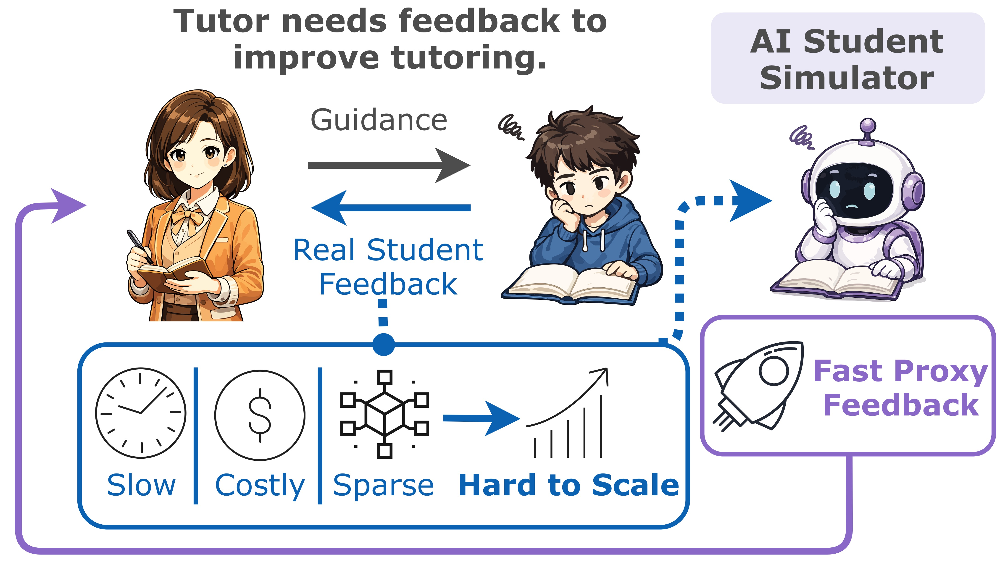
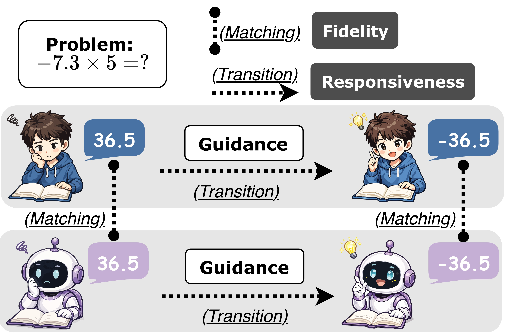
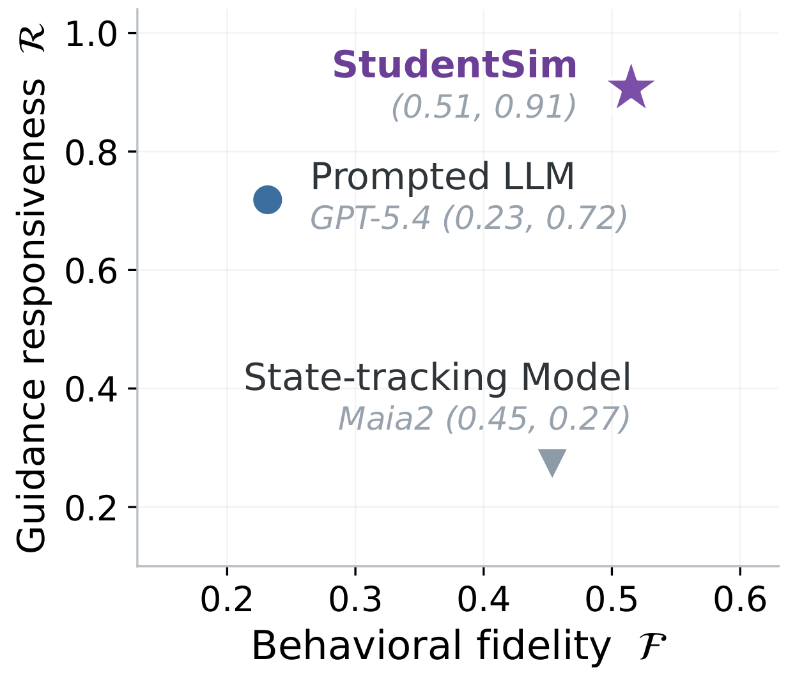
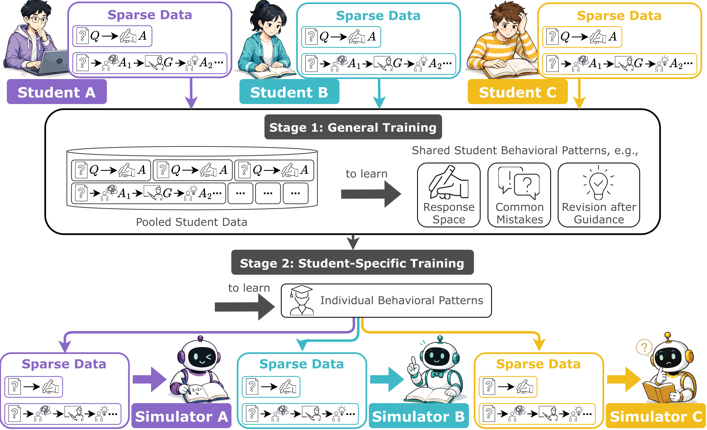
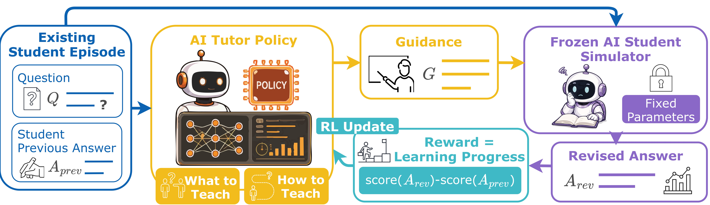

# StudentSim



StudentSim builds per-student simulators for a practical problem in tutor improvement: learning which guidance helps which student when feedback from real learners is slow, costly, and sparse. This requires **behavioral fidelity**: the simulator must carry this student's skill level and characteristic weaknesses, because that is what makes trying guidance on it informative about the real student, and a simulator that answers better than the student does will not have the gaps the tutoring is meant to address. It also needs **guidance responsiveness**, because if the simulator does not change its answer after tutoring the way that student did, it cannot tell you whether the guidance helped.

The repository trains one simulator per student from sparse student records, using pooled training followed by per-student specialization. It covers three domains: chess, second-language English writing (L2), and middle-school mathematics. In chess, the repository also demonstrates training an AI tutor against a student simulator as the reinforcement learning reward: the tutor writes guidance, the simulator answers as the student would, and the tutor is rewarded when the learner's performance improves.

<br clear="all">

<p align="center">
  
  
  <br>
  <sub>Left: example showing what <b>behavioral fidelity</b> compares and what <b>guidance responsiveness</b> compares, for a student and a simulator. Right: the same metrics plotted for (a) StudentSim, (b) a frontier language model prompted to role-play the student, and (c) a knowledge-tracing model without tutor-message access.</sub>
</p>

## Installation

Install the package in editable mode with the extras for the parts you need. The available extras are `chess`, `l2`, `math`, `inference`, `tutor_rl`, `baselines`, and `all`.

For example, to train and evaluate chess:

```bash
pip install -e '.[chess,inference]'
```

For the tutor RL phase, include `tutor_rl`. For the closed-model baselines, include `baselines`. The `tutor_rl` extra requires `libcairo` for board rendering.

By default, StudentSim finds its data, checkpoints, run outputs, model cache, and required binaries automatically, but you can point any of these elsewhere with the `STUDENTSIM_*` environment variables if needed. For steps that call a language model, you must set `AZURE_OPENAI_ENDPOINT` and `AZURE_OPENAI_API_KEY`.

## Student simulator training

<p align="center">
  
</p>

This section has four parts: preparing each domain's records; Stage 1, which trains one adapter per domain on records pooled across many students; Stage 2, which continues that adapter on one student's own records to produce one simulator per student; and evaluation, which scores both metrics on held-out records.

### 1. Data

The three domains differ in what may be redistributed.

**Chess** ships as data. The source is a CC0 chess-game export, so the derived records are redistributed directly, along with the raw export. The released per-player files are already the Stage-2 draw, so for chess there is nothing to build.

**L2** ships as a build. The records are constructed from an EFCAMDAT extract that must be obtained separately. The build is deterministic given that extract and does not call a model:

```bash
python -m studentsim.data.l2.build
```

**Math** ships as a build. The records are constructed from a FoundationalASSIST extract that must be obtained separately. Two of the three steps call a model and so incur API costs:

```bash
python -m studentsim.data.math.audit
python -m studentsim.data.math.build
python -m studentsim.data.math.generate
```

Per-domain source instructions live under `data/`.

### 2. Stage 1 training

Run one Stage-1 supervised fine-tuning job per domain:

```bash
studentsim-train --config configs/training/stage1_<domain>.yaml
```

This trains one LoRA adapter on records pooled across many students in that domain.

### 3. Stage 2 training

Run one Stage-2 job per student, continuing from the Stage-1 adapter:

```bash
studentsim-train --config configs/training/stage2_<domain>.yaml --roster roster.json
```

To train a single student instead of a roster, use `--student-id`. Stage 2 continues the Stage-1 adapter on that student's own records. It inherits the Stage-1 rank rather than starting a fresh adapter.

### 4. Evaluation

Evaluate held-out records with:

```bash
studentsim-eval --domain <domain> --out result.json
```

## Tutor RL for chess

<p align="center">
  
</p>

This phase trains a tutor policy with the frozen student simulator serving as the environment. The work consists of three independent preparation steps: a starting tutor checkpoint, the positions to practise on together with their reward table, and the reward heads. An episode is an existing student record: a question `Q` and the answer that student got wrong, `A_prev`. The tutor policy writes guidance `G`. A frozen student simulator reads it and emits a revised answer `A_rev`. The reward is how much better the revised answer is, and the policy is updated from that signal.

First, a tutor checkpoint to start from. `studentsim-generate-guidance` writes reference guidance for a set of positions, once in each of four teaching styles. `studentsim-build-corpus` filters that guidance, balances the styles and splits the data. Then:

```bash
studentsim-train --config configs/training/tutor_sft.yaml
```

This trains the tutor by supervised fine-tuning. That checkpoint is also the no-RL comparison.

Second, the positions to practise on. `studentsim-precompute-stockfish` fills the engine-evaluation cache. Then `studentsim-build-playground` writes the RL episodes and the reward table from the same positions. 

Third, the reward heads. `studentsim-judge-guidance` asks a model which claims in each message contradict the position. Those labels are merged with rule-derived ones, and `studentsim-train-heads` learns those signals on the frozen simulator.

After those inputs exist, launch RL with:

```bash
studentsim-tutor-rl --config configs/tutor_rl/<name>.yaml
```

The two shipped RL configs differ only in who plays the student.

- `studentsim_reward.yaml`: the trained student simulator produces the revised move.
- `prompted_student_reward.yaml`: a closed model prompted to play the student produces the revised move.

Everything else is held fixed between them: the tutor policy, the starting checkpoint, and the training settings.

## Citation

Citation information will be added here.
